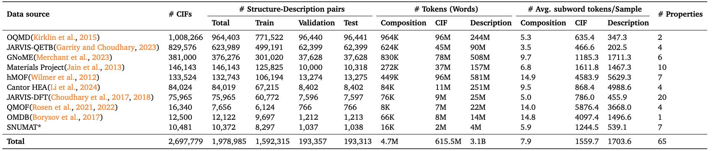

# LLM4Mat-Bench
LLM4Mat-Bench is the largest benchmark to date for evaluating the performance of large language models (LLMs) for materials property prediction.

<p align="center" width="100%">
    
    <br>
    <em>LLM4Mat-Bench Statistics. *https://www.snumat.com/apis</em>
</p>

## How to use
### Installation
```
git clone https://github.com/vertaix/LLM4Mat-Bench.git
cd LLM4Mat-Bench
conda create -n <environment_name> requirement.txt
conda activate <environment_name>
```
### Get the data
- Download the LLM4Mat-Bench data from [this link](https://drive.google.com/drive/folders/1HpGhuNHG4EQCQMZaKPwEQNH9stJKw-ht). Each dataset includes a fixed train/validation/test split for reproducibility and fair model comparison. 
- Save the data into [data folder](data/) where LLM4Mat-Bench is the parent directory.

### Get the checkpoints
- Download the LLM-Prop and MatBERT checkpoints from [this link]().
- Save the checkpoints folder into LLM4Mat-Bench directory.

### Evaluating the trained LLM-Prop and MatBERT
Add any modification to the following scripts to [evaluate.sh](scripts/evaluate.sh)
```bash
#!/usr/bin/env bash

DATA_PATH='data/' # where LLM4Mat_Bench data is saved
RESULTS_PATH='results/' # where to save the results
CHECKPOINTS_PATH='checkpoints/' # where model weights were saved
MODEL_NAME='llmprop' # or 'matbert'
DATASET_NAME='mp' # any dataset name in LLM4Mat_Bench
INPUT_TYPE='formula' # other values: 'cif_structure' and 'description'
PROPERTY_NAME='band_gap' # any property name in $DATASET_NAME. Please check the property names associated with each dataset first

python code/llmprop_and_matbert/evaluate.py \
--data_path $DATA_PATH \
--results_path $RESULTS_PATH \
--checkpoints_path $CHECKPOINTS_PATH \
--model_name $MODEL_NAME \
--dataset_name $DATASET_NAME \
--input_type $INPUT_TYPE \
--property_name $PROPERTY_NAME
``` 
Then run 
```bash
 bash scripts/evaluate.sh
 ```

### Training LLM-Prop and MatBERT from scratch
Add any modification to the following scripts to [train.sh](scripts/train.sh)
```bash
#!/usr/bin/env bash

DATA_PATH='data/' # where LLM4Mat_Bench data is saved
RESULTS_PATH='results/' # where to save the results
CHECKPOINTS_PATH='checkpoints/' # where to save model weights 
MODEL_NAME='llmprop' # or 'matbert'
DATASET_NAME='mp' # any dataset name in LLM4Mat_Bench
INPUT_TYPE='formula' # other values: 'cif_structure' and 'description'
PROPERTY_NAME='band_gap' # any property name in $DATASET_NAME. Please check the property names associated with each dataset first
MAX_LEN=256 # for testing purposes only, the default value is 888 while 2000 has shown to give the best performance
EPOCHS=5 #for testing purposes only, the default value is 200

python code/llmprop_and_matbert/train.py \
--data_path $DATA_PATH \
--results_path $RESULTS_PATH \
--checkpoints_path $CHECKPOINTS_PATH \
--model_name $MODEL_NAME \
--dataset_name $DATASET_NAME \
--input_type $INPUT_TYPE \
--property_name $PROPERTY_NAME \
--max_len $MAX_LEN \
--epochs $EPOCHS
```
Then run 
```bash
bash scripts/train.sh
```

### Generating the property values with LLaMA2-7b-chat model
Add any modification to the following scripts to [llama_inference.sh](scripts/llama_inference.sh)
```bash
#!/usr/bin/env bash

DATA_PATH='data/' # where LLM4Mat_Bench data is saved
RESULTS_PATH='results/' # where to save the results
DATASET_NAME='mp' # any dataset name in LLM4Mat_Bench
INPUT_TYPE='formula' # other values: 'cif_structure' and 'description'
PROPERTY_NAME='band_gap' # any property name in $DATASET_NAME. Please check the property names associated with each dataset first
PROMPT_TYPE='zero_shot' # 'few_shot' can also be used here which let llama see five examples before it generates the answer
MAX_LEN=800 # max_len and batch_size can be modified according to the available resources
BATCH_SIZE=8

python code/llama/llama_inference.py \
--data_path $DATA_PATH \
--results_path $RESULTS_PATH \
--dataset_name $DATASET_NAME \
--input_type $INPUT_TYPE \
--property_name $PROPERTY_NAME \
--prompt_type $PROMPT_TYPE \
--max_len $MAX_LEN \
--batch_size $BATCH_SIZE
```
Then run 
```bash
bash scripts/llama_inference.sh
```

### Evaluating the LLaMA results
After running ```bash scripts/llama_inference.sh```, add any modification to the following scripts to [llama_evaluate.sh](scripts/llama_evaluate.sh)
```bash
#!/usr/bin/env bash

DATA_PATH='data/' # where LLM4Mat_Bench data is saved
RESULTS_PATH='results/' # where to save the results
DATASET_NAME='mp' # any dataset name in LLM4Mat_Bench
INPUT_TYPE='formula' # other values: 'cif_structure' and 'description'
PROPERTY_NAME='band_gap' # any property name in $DATASET_NAME. Please check the property names associated with each dataset first
PROMPT_TYPE='zero_shot' # 'few_shot' can also be used here which let llama see five examples before it generates the answer
MAX_LEN=800 # max_len and batch_size can be modified according to the available resources
BATCH_SIZE=8
MIN_SAMPLES=2 # minimum number of valid outputs from llama (the default number is 10)

python code/llama/evaluate.py \
--data_path $DATA_PATH \
--results_path $RESULTS_PATH \
--dataset_name $DATASET_NAME \
--input_type $INPUT_TYPE \
--property_name $PROPERTY_NAME \
--prompt_type $PROMPT_TYPE \
--max_len $MAX_LEN \
--batch_size $BATCH_SIZE \
--min_samples $MIN_SAMPLES
```
Then run 
```bash 
bash scripts/llama_evaluate.sh
```

## Data LICENSE
The data **LICENSE** belongs to the original creators of each dataset/database.

## Leaderboard
<div style="overflow-x:auto;">
<table>
  <thead>
    <tr>
      <th style="position: sticky; left: 0; background: white;" rowspan="3">Input</th>
      <th style="position: sticky; left: 60px; background: white; z-index: 1;" rowspan="3">Model</th>
      <th colspan="2"> MP</th>
      <th>JARVIS-DFT</th>
      <th>GNoME</th>
      <th>hMOF</th>
      <th>Cantor HEA</th>
      <th>JARVIS-QETB</th>
      <th>OQMD</th>
      <th>QMOF</th>
      <th colspan="2">SNUMAT</th>
      <th>OMDB</th>
    </tr>
    <tr>
      <th> Regression </th>
      <th> Classification </th>
      <th> Regression </th>
      <th> Regression </th>
      <th> Regression </th>
      <th> Regression </th>
      <th> Regression </th>
      <th> Regression </th>
      <th> Regression </th>
      <th> Classification </th>
      <th> Regression </th>
      <th> Regression </th>
    </tr>
    <tr>
      <th> 8 tasks </th>
      <th> 2 tasks </th>
      <th> 20 tasks </th>
      <th> 6 tasks </th>
      <th> 7 tasks </th>
      <th> 6 tasks </th>
      <th> 4 tasks </th>
      <th> 2 tasks </th>
      <th> 4 tasks </th>
      <th> 4 tasks </th>
      <th> 3 tasks </th>
      <th> 1 task </th>
    </tr>
  </thead>
  <tbody>
    <tr>
      <td style="position: sticky; left: 0; background: white;">CIF</td>
      <td style="position: sticky; left: 60px; background: white; z-index: 1;">CGCNN (baseline)</td>
      <td>5.319</td>
      <td>0.846</td>
      <td>7.048</td>
      <td>19.478</td>
      <td>2.257</td>
      <td>17.780</td>
      <td>61.729</td>
      <td>14.496</td>
      <td>3.076</td>
      <td>1.973</td>
      <td>0.722</td>
      <td>2.751</td>
    </tr>
    <tr>
      <td style="position: sticky; left: 0; background: white;" rowspan="4">Comp.</td>
      <td style="position: sticky; left: 60px; background: white; z-index: 1;">Llama 2-7b-chat:0S</td>
      <td>0.389</td>
      <td>0.491</td>
      <td>Inval.</td>
      <td>0.164</td>
      <td>0.174</td>
      <td>0.034</td>
      <td>0.188</td>
      <td>0.105</td>
      <td>0.303</td>
      <td>0.940</td>
      <td>Inval.</td>
      <td>0.885</td>
    </tr>
    <tr>
      <td style="position: sticky; left: 60px; background: white; z-index: 1;">Llama 2-7b-chat:5S</td>
      <td>0.627</td>
      <td>0.507</td>
      <td>0.704</td>
      <td>0.499</td>
      <td>0.655</td>
      <td>0.867</td>
      <td>1.047</td>
      <td>1.160</td>
      <td>0.932</td>
      <td>1.157</td>
      <td>0.466</td>
      <td>1.009</td>
    </tr>
    <tr>
      <td style="position: sticky; left: 60px; background: white; z-index: 1;">MatBERT-109M</td>
      <td><b>5.317</b></td>
      <td>0.722</td>
      <td><b>4.103</b></td>
      <td>12.834</td>
      <td>1.430</td>
      <td>6.769</td>
      <td>11.952</td>
      <td>5.772</td>
      <td><b>2.049</b></td>
      <td><b>1.828</b></td>
      <td>0.712</td>
      <td><b>1.554</b></td>
    </tr>
    <tr>
      <td style="position: sticky; left: 60px; background: white; z-index: 1;">LLM-Prop-35M</td>
      <td>4.394</td>
      <td>0.691</td>
      <td>2.912</td>
      <td><b>15.599</b></td>
      <td><b>1.479</b></td>
      <td><b>8.400</b></td>
      <td><b>59.443</b></td>
      <td><b>6.020</b></td>
      <td>1.958</td>
      <td>1.509</td>
      <td>0.719</td>
      <td>1.507</td>
    </tr>
    <tr>
      <td style="position: sticky; left: 0; background: white;" rowspan="4">CIF</td>
      <td style="position: sticky; left: 60px; background: white; z-index: 1;">Llama 2-7b-chat:0S</td>
      <td>0.392</td>
      <td>0.501</td>
      <td>0.216</td>
      <td>6.746</td>
      <td>0.214</td>
      <td>0.022</td>
      <td>0.278</td>
      <td>0.028</td>
      <td>0.119</td>
      <td>0.682</td>
      <td>0.489</td>
      <td>0.159</td>
    </tr>
    <tr>
      <td style="position: sticky; left: 60px; background: white; z-index: 1;">Llama 2-7b-chat:5S</td>
      <td>Inval.</td>
      <td>0.502</td>
      <td>Inval.</td>
      <td>Inval.</td>
      <td>Inval.</td>
      <td>Inval.</td>
      <td>1.152</td>
      <td>1.391</td>
      <td>Inval.</td>
      <td>Inval.</td>
      <td>0.474</td>
      <td>0.930</td>
    </tr>
    <tr>
      <td style="position: sticky; left: 60px; background: white; z-index: 1;">MatBERT-109M</td>
      <td>7.452</td>
      <td>0.750</td>
      <td>6.211</td>
      <td>14.227</td>
      <td>1.514</td>
      <td>9.958</td>
      <td>47.687</td>
      <td>10.521</td>
      <td>3.024</td>
      <td><b>2.131</b></td>
      <td>0.717</td>
      <td><b>1.777</b></td>
    </tr>
    <tr>
      <td style="position: sticky; left: 60px; background: white; z-index: 1;">LLM-Prop-35M</td>
      <td><b>8.554</b></td>
      <td>0.738</td>
      <td><b>6.756</b></td>
      <td><b>16.032</b></td>
      <td><b>1.623</b></td>
      <td><b>15.728</b></td>
      <td><b>97.919</b></td>
      <td><b>11.041</b></td>
      <td><b>3.076</b></td>
      <td>1.829</td>
      <td>0.660</td>
      <td><b>1.777</b></td>
    </tr>
    <tr>
      <td style="position: sticky; left: 0; background: white;" rowspan="4">Descr.</td>
      <td style="position: sticky; left: 60px; background: white; z-index: 1;">Llama 2-7b-chat:0S</td>
      <td>0.437</td>
      <td>0.500</td>
      <td>0.247</td>
      <td>0.336</td>
      <td>0.193</td>
      <td>0.069</td>
      <td>0.264</td>
      <td>0.106</td>
      <td>0.152</td>
      <td>0.883</td>
      <td>Inval.</td>
      <td>0.155</td>
    </tr>
    <tr>
      <td style="position: sticky; left: 60px; background: white; z-index: 1;">Llama 2-7b-chat:5S</td>
      <td>0.635</td>
      <td>0.502</td>
      <td>0.703</td>
      <td>0.470</td>
      <td>0.653</td>
      <td>0.820</td>
      <td>0.980</td>
      <td>1.230</td>
      <td>0.946</td>
      <td>1.040</td>
      <td>0.568</td>
      <td>1.001</td>
    </tr>
    <tr>
      <td style="position: sticky; left: 60px; background: white; z-index: 1;">MatBERT-109M</td>
      <td>7.651</td>
      <td>0.735</td>
      <td>6.083</td>
      <td>15.558</td>
      <td>1.558</td>
      <td>9.976</td>
      <td>46.586</td>
      <td><b>11.027</b></td>
      <td><b>3.055</b></td>
      <td><b>2.152</b></td>
      <td>0.730</td>
      <td><b>1.847</b></td>
    </tr>
    <tr>
      <td style="position: sticky; left: 60px; background: white; z-index: 1;">LLM-Prop-35M</td>
      <td><b>9.116</b></td>
      <td>0.742</td>
      <td><b>7.204</b></td>
      <td><b>16.224</b></td>
      <td><b>1.706</b></td>
      <td><b>15.926</b></td>
      <td>93.001</td>
      <td>9.995</td>
      <td>3.016</td>
      <td>1.950</td>
      <td>0.735</td>
      <td style="background-color: #CCFFFF;">1.656</td>
    </tr>
  </tbody>
</table>
</div>

<table>
  <caption>Results for MP dataset. The performance on regression tasks is evaluated in terms of MAD:MAE ratio (the higher the better) while that of classification tasks (Is Stable and Is Gab Direct) is evaluated in terms of AUC score. FEPA: Formation Energy Per Atom, EPA: Energy Per Atom.</caption>
  <thead>
    <tr>
      <th rowspan="2">Input</th>
      <th rowspan="2">Model</th>
      <th colspan="10">MP Dataset</th>
    </tr>
    <tr>
      <th>FEPA</th>
      <th>Bandgap</th>
      <th>EPA</th>
      <th>Ehull</th>
      <th>Efermi</th>
      <th>Density</th>
      <th>Density Atomic</th>
      <th>Volume</th>
      <th>Is Stable</th>
      <th>Is Gab Direct</th>
    </tr>
  </thead>
  <tbody>
    <tr>
      <td rowspan="1">CIF</td>
      <td>CGCNN (baseline)</td>
      <td>8.151</td>
      <td>3.255</td>
      <td>7.224</td>
      <td>3.874</td>
      <td>3.689</td>
      <td>8.773</td>
      <td>5.888</td>
      <td>1.703</td>
      <td>0.882</td>
      <td>0.810</td>
    </tr>
    <tr>
      <td rowspan="4">Comp.</td>
      <td>Llama 2-7b-chat:0S</td>
      <td>0.008</td>
      <td>0.623</td>
      <td>0.009</td>
      <td>0.001</td>
      <td>0.003</td>
      <td>0.967</td>
      <td>0.754</td>
      <td>0.747</td>
      <td>0.500</td>
      <td>0.482</td>
    </tr>
    <tr>
      <td>Llama 2-7b-chat:5S</td>
      <td>0.33</td>
      <td>1.217</td>
      <td>0.239</td>
      <td>0.132</td>
      <td>0.706</td>
      <td>0.899</td>
      <td>0.724</td>
      <td>0.771</td>
      <td>0.502</td>
      <td>0.512</td>
    </tr>
    <tr>
      <td>MatBERT-109M</td>
      <td><strong>8.151</strong></td>
      <td><strong>2.971</strong></td>
      <td><strong>9.32</strong></td>
      <td><strong>2.583</strong></td>
      <td><strong>3.527</strong></td>
      <td><strong>7.626</strong></td>
      <td><strong>5.26</strong></td>
      <td><strong>3.099</strong></td>
      <td><strong>0.764</strong></td>
      <td><strong>0.681</strong></td>
    </tr>
    <tr>
      <td>LLM-Prop-35M</td>
      <td>7.482</td>
      <td>2.345</td>
      <td>7.437</td>
      <td>2.006</td>
      <td>3.159</td>
      <td>6.682</td>
      <td>3.523</td>
      <td>2.521</td>
      <td>0.746</td>
      <td>0.636</td>
    </tr>
    <tr>
      <td rowspan="4">CIF</td>
      <td>Llama 2-7b-chat:0S</td>
      <td>0.032</td>
      <td>0.135</td>
      <td>0.022</td>
      <td>0.001</td>
      <td>0.015</td>
      <td>0.97</td>
      <td>0.549</td>
      <td>1.41</td>
      <td>0.503</td>
      <td>0.499</td>
    </tr>
    <tr>
      <td>Llama 2-7b-chat:5S</td>
      <td style="background-color:#FFCCE5;">Inval.</td>
      <td>1.111</td>
      <td>0.289</td>
      <td style="background-color:#FFCCE5;">Inval.</td>
      <td>0.685</td>
      <td>0.98</td>
      <td>0.99</td>
      <td>0.926</td>
      <td>0.498</td>
      <td>0.506</td>
    </tr>
    <tr>
      <td>MatBERT-109M</td>
      <td>11.017</td>
      <td>3.423</td>
      <td>13.244</td>
      <td><strong>3.808</strong></td>
      <td>4.435</td>
      <td>10.426</td>
      <td><strong>6.686</strong></td>
      <td>6.58</td>
      <td><strong>0.790</strong></td>
      <td><strong>0.710</strong></td>
    </tr>
    <tr>
      <td>LLM-Prop-35M</td>
      <td><strong>14.322</strong></td>
      <td><strong>3.758</strong></td>
      <td><strong>17.354</strong></td>
      <td>2.182</td>
      <td><strong>4.515</strong></td>
      <td><strong>13.834</strong></td>
      <td>4.913</td>
      <td>7.556</td>
      <td>0.776</td>
      <td>0.700</td>
    </tr>
    <tr>
      <td rowspan="4">Descr.</td>
      <td>Llama 2-7b-chat:0S</td>
      <td>0.019</td>
      <td>0.633</td>
      <td>0.023</td>
      <td>0.001</td>
      <td>0.008</td>
      <td>1.31</td>
      <td>0.693</td>
      <td>0.807</td>
      <td>0.500</td>
      <td>0.500</td>
    </tr>
    <tr>
      <td>Llama 2-7b-chat:5S</td>
      <td>0.394</td>
      <td>1.061</td>
      <td>0.297</td>
      <td>0.247</td>
      <td>0.684</td>
      <td>0.916</td>
      <td>0.782</td>
      <td>0.704</td>
      <td>0.500</td>
      <td>0.504</td>
    </tr>
    <tr>
      <td>MatBERT-109M</td>
      <td>11.935</td>
      <td>3.524</td>
      <td>13.851</td>
      <td style="background-color:#CCE5FF;"><strong>4.085</strong></td>
      <td>4.323</td>
      <td>9.9</td>
      <td style="background-color:#CCE5FF;"><strong>6.899</strong></td>
      <td>6.693</td>
      <td style="background-color:#CCE5FF;"><strong>0.794</strong></td>
      <td style="background-color:#CCE5FF;"><strong>0.713</strong></td>
    </tr>
    <tr>
      <td>LLM-Prop-35M</td>
      <td style="background-color:#CCE5FF;"><strong>15.913</strong></td>
      <td style="background-color:#CCE5FF;"><strong>3.931</strong></td>
      <td style="background-color:#CCE5FF;"><strong>18.412</strong></td>
      <td>2.74</td>
      <td style="background-color:#CCE5FF;"><strong>4.598</strong></td>
      <td style="background-color:#CCE5FF;"><strong>14.388</strong></td>
      <td>4.063</td>
      <td style="background-color:#CCE5FF;"><strong>8.888</strong></td>
      <td style="background-color:#CCE5FF;"><strong>0.794</strong></td>
      <td>0.690</td>
    </tr>
  </tbody>
</table>

<table>
  <caption>Results for SNUMAT. The performance on regression tasks is evaluated in terms of MAD:MAE ratio (the higher the better) while that of classification tasks (Is Direct, Is Direct HSE, and SOC) is evaluated in terms of AUC score.</caption>
  <thead>
    <tr>
      <th rowspan="2">Input</th>
      <th rowspan="2">Model</th>
      <th>Bandgap GGA</th>
      <th>Bandgap HSE</th>
      <th>Bandgap GGA Optical</th>
      <th>Bandgap HSE Optical</th>
      <th>Is Direct</th>
      <th>Is Direct HSE</th>
      <th>SOC</th>
    </tr>
    <tr>
      <th>10.3K</th>
      <th>10.3K</th>
      <th>10.3K</th>
      <th>10.3K</th>
      <th>10.3K</th>
      <th>10.3K</th>
      <th>10.3K</th>
    </tr>
  </thead>
  <tbody>
    <tr>
      <td>CIF</td>
      <td>CGCNN (baseline)</td>
      <td>2.075</td>
      <td>2.257</td>
      <td>1.727</td>
      <td>1.835</td>
      <td>0.691</td>
      <td>0.675</td>
      <td>0.800</td>
    </tr>
    <tr>
      <td rowspan="4">Comp.</td>
      <td>Llama 2-7b-chat:0S</td>
      <td>0.797</td>
      <td>0.948</td>
      <td>1.156</td>
      <td>0.859</td>
      <td>0.503</td>
      <td>0.484</td>
      <td style="background-color:#FFCCE5;">Inval.</td>
    </tr>
    <tr>
      <td>Llama 2-7b-chat:5S</td>
      <td>1.267</td>
      <td>1.327</td>
      <td>0.862</td>
      <td>1.174</td>
      <td>0.475</td>
      <td>0.468</td>
      <td>0.455</td>
    </tr>
    <tr>
      <td>MatBERT-109M</td>
      <td><strong>1.899</strong></td>
      <td><strong>1.975</strong></td>
      <td><strong>1.646</strong></td>
      <td><strong>1.793</strong></td>
      <td><strong>0.671</strong></td>
      <td><strong>0.645</strong></td>
      <td>0.820</td>
    </tr>
    <tr>
      <td>LLM-Prop-35M</td>
      <td>1.533</td>
      <td>1.621</td>
      <td>1.392</td>
      <td>1.491</td>
      <td>0.647</td>
      <td>0.624</td>
      <td><strong>0.829</strong></td>
    </tr>
    <tr>
      <td rowspan="4">CIF</td>
      <td>Llama 2-7b-chat:0S</td>
      <td>0.346</td>
      <td>0.454</td>
      <td>1.09</td>
      <td>0.838</td>
      <td>0.479</td>
      <td>0.488</td>
      <td>0.500</td>
    </tr>
    <tr>
      <td>Llama 2-7b-chat:5S</td>
      <td style="background-color:#FFCCE5;">Inval.</td>
      <td style="background-color:#FFCCE5;">Inval.</td>
      <td style="background-color:#FFCCE5;">Inval.</td>
      <td style="background-color:#FFCCE5;">Inval.</td>
      <td>0.494</td>
      <td>0.500</td>
      <td>0.427</td>
    </tr>
    <tr>
      <td>MatBERT-109M</td>
      <td><strong>2.28</strong></td>
      <td style="background-color:#CCE5FF;"><strong>2.472</strong></td>
      <td><strong>1.885</strong></td>
      <td>1.889</td>
      <td><strong>0.677</strong></td>
      <td>0.650</td>
      <td><strong>0.823</strong></td>
    </tr>
    <tr>
      <td>LLM-Prop-35M</td>
      <td>1.23</td>
      <td>2.401</td>
      <td>1.786</td>
      <td><strong>1.9</strong></td>
      <td>0.661</td>
      <td style="background-color:#CCE5FF;"><strong>0.664</strong></td>
      <td>0.656</td>
    </tr>
    <tr>
      <td rowspan="4">Descr.</td>
      <td>Llama 2-7b-chat:0S</td>
      <td>0.802</td>
      <td>0.941</td>
      <td>1.013</td>
      <td>0.779</td>
      <td>0.499</td>
      <td>0.509</td>
      <td style="background-color:#FFCCE5;">Inval.</td>
    </tr>
    <tr>
      <td>Llama 2-7b-chat:5S</td>
      <td>0.774</td>
      <td>1.315</td>
      <td>0.901</td>
      <td>1.172</td>
      <td>0.594</td>
      <td>0.623</td>
      <td>0.486</td>
    </tr>
    <tr>
      <td>MatBERT-109M</td>
      <td style="background-color:#CCE5FF;"><strong>2.298</strong></td>
      <td><strong>2.433</strong></td>
      <td style="background-color:#CCE5FF;"><strong>1.901</strong></td>
      <td style="background-color:#CCE5FF;"><strong>1.978</strong></td>
      <td style="background-color:#CCE5FF;"><strong>0.683</strong></td>
      <td>0.645</td>
      <td>0.862</td>
    </tr>
    <tr>
      <td>LLM-Prop-35M</td>
      <td>2.251</td>
      <td>2.142</td>
      <td>1.84</td>
      <td>1.569</td>
      <td>0.681</td>
      <td><strong>0.657</strong></td>
      <td style="background-color:#CCE5FF;"><strong>0.866</strong></td>
    </tr>
  </tbody>
</table>

<table style="width: 100%; border-collapse: collapse;">
    <caption>
        Results for GNoME. The performance on regression tasks is evaluated in terms of MAD:MAE ratio (the higher the better). 
        FEPA: Formation Energy Per Atom, DEPA: Decomposition Energy Per Atom, Tot. En.: Total Energy.
    </caption>
    <thead>
        <tr>
            <th rowspan="2">Input</th>
            <th rowspan="2">Model</th>
            <th colspan="6">GNoME Dataset</th>
        </tr>
        <tr>
            <th>FEPA</th>
            <th>Bandgap</th>
            <th>DEPA</th>
            <th>Tot. En.</th>
            <th>Volume</th>
            <th>Density</th>
        </tr>
    </thead>
    <tbody>
        <tr>
            <td>CIF</td>
            <td>CGCNN (baseline)</td>
            <td>34.57</td>
            <td>8.549</td>
            <td>2.787</td>
            <td>7.443</td>
            <td>7.967</td>
            <td>56.077</td>
        </tr>
        <tr>
            <td rowspan="4">Comp.</td>
            <td>Llama 2-7b-chat:0S</td>
            <td>0.002</td>
            <td>0.177</td>
            <td>0.0</td>
            <td>0.088</td>
            <td>0.455</td>
            <td>0.368</td>
        </tr>
        <tr>
            <td>Llama 2-7b-chat:5S</td>
            <td>0.194</td>
            <td>0.086</td>
            <td>0.255</td>
            <td>0.765</td>
            <td>1.006</td>
            <td>0.865</td>
        </tr>
        <tr>
            <td>MatBERT-109M</td>
            <td style="background-color: rgb(204, 229, 255); font-weight: bold;">30.248</td>
            <td><strong>4.692</strong></td>
            <td><strong>2.787</strong></td>
            <td>8.57</td>
            <td>13.157</td>
            <td>15.145</td>
        </tr>
        <tr>
            <td>LLM-Prop-35M</td>
            <td>25.472</td>
            <td>3.735</td>
            <td>1.858</td>
            <td style="background-color: rgb(204, 229, 255); font-weight: bold;">21.624</td>
            <td><strong>16.556</strong></td>
            <td><strong>25.615</strong></td>
        </tr>
        <tr>
            <td rowspan="4">CIF</td>
            <td>Llama 2-7b-chat:0S</td>
            <td>0.003</td>
            <td>0.045</td>
            <td>0.0</td>
            <td>0.706</td>
            <td style="background-color: rgb(204, 229, 255); font-weight: bold;">43.331</td>
            <td>0.794</td>
        </tr>
        <tr>
            <td>Llama 2-7b-chat:5S</td>
            <td style="background-color: rgb(255, 204, 229);">Inval.</td>
            <td>0.087</td>
            <td style="background-color: rgb(255, 204, 229);">Inval.</td>
            <td style="background-color: rgb(255, 204, 229);">Inval.</td>
            <td>1.029</td>
            <td>0.878</td>
        </tr>
        <tr>
            <td>MatBERT-109M</td>
            <td>24.199</td>
            <td style="background-color: rgb(204, 229, 255); font-weight: bold;">9.16</td>
            <td style="background-color: rgb(204, 229, 255); font-weight: bold;">3.716</td>
            <td>15.309</td>
            <td>16.691</td>
            <td>16.467</td>
        </tr>
        <tr>
            <td>LLM-Prop-35M</td>
            <td style="font-weight: bold;">28.469</td>
            <td>3.926</td>
            <td>3.344</td>
            <td style="font-weight: bold;">17.837</td>
            <td>17.082</td>
            <td style="font-weight: bold;">25.615</td>
        </tr>
        <tr>
            <td rowspan="4">Descr.</td>
            <td>Llama 2-7b-chat:0S</td>
            <td>0.002</td>
            <td>0.114</td>
            <td>0.0</td>
            <td>0.661</td>
            <td>0.654</td>
            <td>0.805</td>
        </tr>
        <tr>
            <td>Llama 2-7b-chat:5S</td>
            <td>0.192</td>
            <td>0.086</td>
            <td>0.106</td>
            <td>0.75</td>
            <td>1.006</td>
            <td>0.891</td>
        </tr>
        <tr>
            <td>MatBERT-109M</td>
            <td style="background-color: rgb(204, 229, 255); font-weight: bold;">30.248</td>
            <td><strong>5.829</strong></td>
            <td style="background-color: rgb(204, 229, 255); font-weight: bold;">3.716</td>
            <td style="font-weight: bold;">18.205</td>
            <td><strong>17.824</strong></td>
            <td>16.599</td>
        </tr>
        <tr>
            <td>LLM-Prop-35M</td>
            <td>28.469</td>
            <td>5.27</td>
            <td style="background-color: rgb(204, 229, 255); font-weight: bold;">3.716</td>
            <td>17.02</td>
            <td>17.02</td>
            <td style="background-color: rgb(204, 229, 255); font-weight: bold;">25.936</td>
        </tr>
    </tbody>
</table>

<table style="width: 100%; border-collapse: collapse;">
    <caption>
        Results for hMOF. The performance on regression tasks is evaluated in terms of MAD:MAE ratio (the higher the better).
    </caption>
    <thead>
        <tr>
            <th rowspan="2">Input</th>
            <th rowspan="2">Model</th>
            <th colspan="6">hMOF Dataset</th>
        </tr>
        <tr>
            <th>Max CO2</th>
            <th>Min CO2</th>
            <th>LCD</th>
            <th>PLD</th>
            <th>Void Fraction</th>
            <th>Surface Area m<sup>2</sup>g</th>
            <th>Surface Area m<sup>2</sup>cm<sup>3</sup></th>
        </tr>
    </thead>
    <tbody>
        <tr>
            <td>CIF</td>
            <td>CGCNN (baseline)</td>
            <td>1.719</td>
            <td>1.617</td>
            <td>1.989</td>
            <td>1.757</td>
            <td>2.912</td>
            <td>3.765</td>
            <td>2.039</td>
        </tr>
        <tr>
            <td rowspan="4">Comp.</td>
            <td>Llama 2-7b-chat:0S</td>
            <td>0.011</td>
            <td>0.002</td>
            <td>0.009</td>
            <td>0.008</td>
            <td>0.5</td>
            <td>0.454</td>
            <td>0.233</td>
        </tr>
        <tr>
            <td>Llama 2-7b-chat:5S</td>
            <td>0.679</td>
            <td>0.058</td>
            <td>0.949</td>
            <td>1.026</td>
            <td>0.945</td>
            <td>0.567</td>
            <td>0.366</td>
        </tr>
        <tr>
            <td>MatBERT-109M</td>
            <td>1.335</td>
            <td style="font-weight: bold;">1.41</td>
            <td style="font-weight: bold;">1.435</td>
            <td>1.378</td>
            <td>1.57</td>
            <td>1.517</td>
            <td style="font-weight: bold;">1.367</td>
        </tr>
        <tr>
            <td>LLM-Prop-35M</td>
            <td style="font-weight: bold;">1.41</td>
            <td>1.392</td>
            <td style="font-weight: bold;">1.432</td>
            <td style="font-weight: bold;">1.468</td>
            <td style="font-weight: bold;">1.672</td>
            <td style="font-weight: bold;">1.657</td>
            <td>1.321</td>
        </tr>
        <tr>
            <td rowspan="4">CIF</td>
            <td>Llama 2-7b-chat:0S</td>
            <td>0.017</td>
            <td>0.003</td>
            <td>0.016</td>
            <td>0.011</td>
            <td>0.549</td>
            <td>0.54</td>
            <td>0.359</td>
        </tr>
        <tr>
            <td>Llama 2-7b-chat:5S</td>
            <td style="background-color: rgb(255, 204, 229);">Inval.</td>
            <td style="background-color: rgb(255, 204, 229);">Inval.</td>
            <td>0.951</td>
            <td>1.067</td>
            <td style="background-color: rgb(255, 204, 229);">Inval.</td>
            <td style="background-color: rgb(255, 204, 229);">Inval.</td>
            <td style="background-color: rgb(255, 204, 229);">Inval.</td>
        </tr>
        <tr>
            <td>MatBERT-109M</td>
            <td>1.421</td>
            <td style="font-weight: bold;">1.428</td>
            <td>1.544</td>
            <td style="font-weight: bold;">1.482</td>
            <td>1.641</td>
            <td>1.622</td>
            <td style="font-weight: bold;">1.461</td>
        </tr>
        <tr>
            <td>LLM-Prop-35M</td>
            <td style="font-weight: bold;">1.564</td>
            <td>1.41</td>
            <td style="background-color: rgb(204, 229, 255); font-weight: bold;">1.753</td>
            <td>1.435</td>
            <td style="background-color: rgb(204, 229, 255); font-weight: bold;">1.9</td>
            <td style="font-weight: bold;">1.926</td>
            <td>1.374</td>
        </tr>
        <tr>
            <td rowspan="4">Descr.</td>
            <td>Llama 2-7b-chat:0S</td>
            <td>0.129</td>
            <td>0.014</td>
            <td>0.026</td>
            <td>0.006</td>
            <td>0.382</td>
            <td>0.497</td>
            <td>0.299</td>
        </tr>
        <tr>
            <td>Llama 2-7b-chat:5S</td>
            <td>0.684</td>
            <td>0.058</td>
            <td>0.955</td>
            <td>1.006</td>
            <td>0.931</td>
            <td>0.571</td>
            <td>0.37</td>
        </tr>
        <tr>
            <td>MatBERT-109M</td>
            <td>1.438</td>
            <td>1.466</td>
            <td>1.602</td>
            <td>1.511</td>
            <td>1.719</td>
            <td>1.697</td>
            <td>1.475</td>
        </tr>
        <tr>
            <td>LLM-Prop-35M</td>
            <td style="background-color: rgb(204, 229, 255); font-weight: bold;">1.659</td>
            <td style="background-color: rgb(204, 229, 255); font-weight: bold;">1.486</td>
            <td>1.623</td>
            <td style="background-color: rgb(204, 229, 255); font-weight: bold;">1.789</td>
            <td>1.736</td>
            <td style="background-color: rgb(204, 229, 255); font-weight: bold;">2.144</td>
            <td style="background-color: rgb(204, 229, 255); font-weight: bold;">1.508</td>
        </tr>
    </tbody>
</table>

<table style="width: 100%; border-collapse: collapse;">
    <caption>
        Results for Cantor HEA. The performance on regression tasks is evaluated in terms of MAD:MAE ratio (the higher the better). FEPA: Formation Energy Per Atom, EPA: Energy Per Atom, VPA: Volume Per Atom.
    </caption>
    <thead>
        <tr>
            <th rowspan="2">Input</th>
            <th rowspan="2">Model</th>
            <th colspan="4">Cantor HEA Dataset</th>
        </tr>
        <tr>
            <th>FEPA</th>
            <th>EPA</th>
            <th>Ehull</th>
            <th>VPA</th>
        </tr>
    </thead>
    <tbody>
        <tr>
            <td>CIF</td>
            <td>CGCNN (baseline)</td>
            <td>9.036</td>
            <td>49.521</td>
            <td>9.697</td>
            <td>2.869</td>
        </tr>
        <tr>
            <td rowspan="4">Comp.</td>
            <td>Llama 2-7b-chat:0S</td>
            <td>0.005</td>
            <td>0.098</td>
            <td>0.003</td>
            <td>0.031</td>
        </tr>
        <tr>
            <td>Llama 2-7b-chat:5S</td>
            <td>0.896</td>
            <td>0.658</td>
            <td>0.928</td>
            <td>0.986</td>
        </tr>
        <tr>
            <td>MatBERT-109M</td>
            <td style="font-weight: bold;">3.286</td>
            <td>16.17</td>
            <td style="font-weight: bold;">5.134</td>
            <td>2.489</td>
        </tr>
        <tr>
            <td>LLM-Prop-35M</td>
            <td style="font-weight: bold;">3.286</td>
            <td style="font-weight: bold;">22.638</td>
            <td style="font-weight: bold;">5.134</td>
            <td style="font-weight: bold;">2.543</td>
        </tr>
        <tr>
            <td rowspan="4">CIF</td>
            <td>Llama 2-7b-chat:0S</td>
            <td>0.001</td>
            <td>0.084</td>
            <td>0.0</td>
            <td>0.004</td>
        </tr>
        <tr>
            <td>Llama 2-7b-chat:5S</td>
            <td style="background-color: rgb(255, 204, 229);">Inval.</td>
            <td style="background-color: rgb(255, 204, 229);">Inval.</td>
            <td style="background-color: rgb(255, 204, 229);">Inval.</td>
            <td style="background-color: rgb(255, 204, 229);">Inval.</td>
        </tr>
        <tr>
            <td>MatBERT-109M</td>
            <td>7.229</td>
            <td>17.607</td>
            <td>9.187</td>
            <td>5.809</td>
        </tr>
        <tr>
            <td>LLM-Prop-35M</td>
            <td style="background-color: rgb(204, 229, 255); font-weight: bold;">8.341</td>
            <td style="background-color: rgb(204, 229, 255); font-weight: bold;">36.015</td>
            <td style="background-color: rgb(204, 229, 255); font-weight: bold;">11.636</td>
            <td style="font-weight: bold;">6.919</td>
        </tr>
        <tr>
            <td rowspan="4">Descr.</td>
            <td>Llama 2-7b-chat:0S</td>
            <td>0.001</td>
            <td>0.101</td>
            <td>0.164</td>
            <td>0.011</td>
        </tr>
        <tr>
            <td>Llama 2-7b-chat:5S</td>
            <td>0.797</td>
            <td>0.615</td>
            <td>0.938</td>
            <td>0.93</td>
        </tr>
        <tr>
            <td>MatBERT-109M</td>
            <td>7.229</td>
            <td>17.607</td>
            <td>9.187</td>
            <td>5.881</td>
        </tr>
        <tr>
            <td>LLM-Prop-35M</td>
            <td style="background-color: rgb(204, 229, 255); font-weight: bold;">8.341</td>
            <td style="background-color: rgb(204, 229, 255); font-weight: bold;">36.015</td>
            <td style="background-color: rgb(204, 229, 255); font-weight: bold;">11.636</td>
            <td style="background-color: rgb(204, 229, 255); font-weight: bold;">7.713</td>
        </tr>
    </tbody>
</table>


<table style="width: 100%; border-collapse: collapse;">
    <caption>
        Results for QMOF. The performance on regression tasks is evaluated in terms of MAD:MAE ratio (the higher the better). Tot. En.: Total Energy.
    </caption>
    <thead>
        <tr>
            <th rowspan="2">Input</th>
            <th rowspan="2">Model</th>
            <th colspan="4">QMOF Dataset</th>
        </tr>
        <tr>
            <th>Bandgap</th>
            <th>Tot. En.</th>
            <th>LCD</th>
            <th>PLD</th>
        </tr>
    </thead>
    <tbody>
        <tr>
            <td>CIF</td>
            <td>CGCNN (baseline)</td>
            <td>2.431</td>
            <td>1.489</td>
            <td>4.068</td>
            <td>4.317</td>
        </tr>
        <tr>
            <td rowspan="4">Comp.</td>
            <td>Llama 2-7b-chat:0S</td>
            <td>0.901</td>
            <td>0.26</td>
            <td>0.045</td>
            <td>0.009</td>
        </tr>
        <tr>
            <td>Llama 2-7b-chat:5S</td>
            <td>0.648</td>
            <td>0.754</td>
            <td>1.241</td>
            <td>1.086</td>
        </tr>
        <tr>
            <td>MatBERT-109M</td>
            <td style="font-weight: bold;">1.823</td>
            <td style="font-weight: bold;">1.695</td>
            <td style="font-weight: bold;">2.329</td>
            <td style="font-weight: bold;">2.349</td>
        </tr>
        <tr>
            <td>LLM-Prop-35M</td>
            <td>1.759</td>
            <td>1.621</td>
            <td>2.293</td>
            <td>2.157</td>
        </tr>
        <tr>
            <td rowspan="4">CIF</td>
            <td>Llama 2-7b-chat:0S</td>
            <td>0.201</td>
            <td>0.244</td>
            <td>0.02</td>
            <td>0.011</td>
        </tr>
        <tr>
            <td>Llama 2-7b-chat:5S</td>
            <td style="background-color: rgb(255, 204, 229);">Inval.</td>
            <td style="background-color: rgb(255, 204, 229);">Inval.</td>
            <td style="background-color: rgb(255, 204, 229);">Inval.</td>
            <td style="background-color: rgb(255, 204, 229);">Inval.</td>
        </tr>
        <tr>
            <td>MatBERT-109M</td>
            <td>1.994</td>
            <td style="background-color: rgb(204, 229, 255); font-weight: bold;">4.378</td>
            <td>2.908</td>
            <td>2.818</td>
        </tr>
        <tr>
            <td>LLM-Prop-35M</td>
            <td style="background-color: rgb(204, 229, 255); font-weight: bold;">2.166</td>
            <td>4.323</td>
            <td style="font-weight: bold;">2.947</td>
            <td style="font-weight: bold;">2.87</td>
        </tr>
        <tr>
            <td rowspan="4">Descr.</td>
            <td>Llama 2-7b-chat:0S</td>
            <td>0.358</td>
            <td>0.217</td>
            <td>0.025</td>
            <td>0.006</td>
        </tr>
        <tr>
            <td>Llama 2-7b-chat:5S</td>
            <td>0.777</td>
            <td>0.713</td>
            <td>1.125</td>
            <td>1.17</td>
        </tr>
        <tr>
            <td>MatBERT-109M</td>
            <td style="background-color: rgb(204, 229, 255); font-weight: bold;">2.166</td>
            <td>4.133</td>
            <td style="background-color: rgb(204, 229, 255); font-weight: bold;">2.981</td>
            <td style="background-color: rgb(204, 229, 255); font-weight: bold;">2.941</td>
        </tr>
        <tr>
            <td>LLM-Prop-35M</td>
            <td>2.091</td>
            <td style="font-weight: bold;">4.312</td>
            <td>2.831</td>
            <td>2.829</td>
        </tr>
    </tbody>
</table>

<table style="width: 100%; border-collapse: collapse;">
    <caption>
        Results for JARVIS-QETB. The performance on regression tasks is evaluated in terms of MAD:MAE ratio (the higher the better). FEPA: Formation Energy Per Atom, EPA: Energy Per Atom, Tot. En.: Total Energy, Ind. Bandgap: Indirect Bandgap.
    </caption>
    <thead>
        <tr>
            <th rowspan="2">Input</th>
            <th rowspan="2">Model</th>
            <th colspan="4">JARVIS-QETB Dataset</th>
        </tr>
        <tr>
            <th>FEPA</th>
            <th>EPA</th>
            <th>Tot. En.</th>
            <th>Ind. Bandgap</th>
        </tr>
    </thead>
    <tbody>
        <tr>
            <td>CIF</td>
            <td>CGCNN (baseline)</td>
            <td>1.964</td>
            <td>228.201</td>
            <td>11.218</td>
            <td>5.534</td>
        </tr>
        <tr>
            <td rowspan="4">Comp.</td>
            <td>Llama 2-7b-chat:0S</td>
            <td>0.003</td>
            <td>0.369</td>
            <td>0.172</td>
            <td>0.21</td>
        </tr>
        <tr>
            <td>Llama 2-7b-chat:5S</td>
            <td>0.812</td>
            <td>1.037</td>
            <td>1.032</td>
            <td>1.306</td>
        </tr>
        <tr>
            <td>MatBERT-109M</td>
            <td>1.431</td>
            <td>37.979</td>
            <td>8.19</td>
            <td>0.21</td>
        </tr>
        <tr>
            <td>LLM-Prop-35M</td>
            <td style="font-weight: bold;">2.846</td>
            <td style="font-weight: bold;">211.757</td>
            <td style="font-weight: bold;">21.309</td>
            <td style="font-weight: bold;">1.861</td>
        </tr>
        <tr>
            <td rowspan="4">CIF</td>
            <td>Llama 2-7b-chat:0S</td>
            <td>0.003</td>
            <td>0.412</td>
            <td>0.656</td>
            <td>0.04</td>
        </tr>
        <tr>
            <td>Llama 2-7b-chat:5S</td>
            <td>0.8</td>
            <td>1.024</td>
            <td>1.076</td>
            <td>1.71</td>
        </tr>
        <tr>
            <td>MatBERT-109M</td>
            <td>24.72</td>
            <td>135.156</td>
            <td>26.094</td>
            <td style="font-weight: bold;">4.779</td>
        </tr>
        <tr>
            <td>LLM-Prop-35M</td>
            <td>23.346</td>
            <td style="background-color: rgb(204, 229, 255); font-weight: bold;">318.291</td>
            <td style="background-color: rgb(204, 229, 255); font-weight: bold;">48.192</td>
            <td>1.845</td>
        </tr>
        <tr>
            <td rowspan="4">Descr.</td>
            <td>Llama 2-7b-chat:0S</td>
            <td>0.003</td>
            <td>0.408</td>
            <td>0.484</td>
            <td>0.16</td>
        </tr>
        <tr>
            <td>Llama 2-7b-chat:5S</td>
            <td>0.85</td>
            <td>1.015</td>
            <td>1.035</td>
            <td>1.021</td>
        </tr>
        <tr>
            <td>MatBERT-109M</td>
            <td style="background-color: rgb(204, 229, 255); font-weight: bold;">26.265</td>
            <td>122.884</td>
            <td>29.409</td>
            <td style="background-color: rgb(204, 229, 255); font-weight: bold;">7.788</td>
        </tr>
        <tr>
            <td>LLM-Prop-35M</td>
            <td>22.513</td>
            <td>312.218</td>
            <td>35.43</td>
            <td>1.845</td>
        </tr>
    </tbody>
</table>

<table style="width: 100%; border-collapse: collapse;">
    <caption>
        Results for OQMD. The performance on regression tasks is evaluated in terms of MAD:MAE ratio (the higher the better). FEPA: Formation Energy Per Atom.
    </caption>
    <thead>
        <tr>
            <th rowspan="2">Input</th>
            <th rowspan="2">Model</th>
            <th colspan="2">OQMD Dataset</th>
        </tr>
        <tr>
            <th>FEPA</th>
            <th>Bandgap</th>
        </tr>
    </thead>
    <tbody>
        <tr>
            <td>CIF</td>
            <td>CGCNN (baseline)</td>
            <td>22.291</td>
            <td>6.701</td>
        </tr>
        <tr>
            <td rowspan="4">Comp.</td>
            <td>Llama 2-7b-chat:0S</td>
            <td>0.019</td>
            <td>0.192</td>
        </tr>
        <tr>
            <td>Llama 2-7b-chat:5S</td>
            <td>1.013</td>
            <td>1.306</td>
        </tr>
        <tr>
            <td>MatBERT-109M</td>
            <td>7.662</td>
            <td style="font-weight: bold;">3.883</td>
        </tr>
        <tr>
            <td>LLM-Prop-35M</td>
            <td style="font-weight: bold;">9.195</td>
            <td>2.845</td>
        </tr>
        <tr>
            <td rowspan="4">CIF</td>
            <td>Llama 2-7b-chat:0S</td>
            <td>0.009</td>
            <td>0.047</td>
        </tr>
        <tr>
            <td>Llama 2-7b-chat:5S</td>
            <td>1.051</td>
            <td>1.731</td>
        </tr>
        <tr>
            <td>MatBERT-109M</td>
            <td>13.879</td>
            <td style="background-color: rgb(204, 229, 255); font-weight: bold;">7.163</td>
        </tr>
        <tr>
            <td>LLM-Prop-35M</td>
            <td style="background-color: rgb(204, 229, 255); font-weight: bold;">18.861</td>
            <td>3.22</td>
        </tr>
        <tr>
            <td rowspan="4">Descr.</td>
            <td>Llama 2-7b-chat:0S</td>
            <td>0.025</td>
            <td>0.187</td>
        </tr>
        <tr>
            <td>Llama 2-7b-chat:5S</td>
            <td>0.991</td>
            <td>1.468</td>
        </tr>
        <tr>
            <td>MatBERT-109M</td>
            <td>15.012</td>
            <td style="font-weight: bold;">7.041</td>
        </tr>
        <tr>
            <td>LLM-Prop-35M</td>
            <td style="font-weight: bold;">16.346</td>
            <td>3.644</td>
        </tr>
    </tbody>
</table>

<table style="width: 100%; border-collapse: collapse;">
    <caption>
        Results for OMDB. The performance on regression tasks is evaluated in terms of MAD:MAE ratio (the higher the better).
    </caption>
    <thead>
        <tr>
            <th rowspan="2">Input</th>
            <th rowspan="2">Model</th>
            <th colspan="1">OMDB Dataset</th>
        </tr>
        <tr>
            <th>Bandgap</th>
        </tr>
    </thead>
    <tbody>
        <tr>
            <td>CIF</td>
            <td>CGCNN (baseline)</td>
            <td>2.751</td>
        </tr>
        <tr>
            <td rowspan="4">Comp.</td>
            <td>Llama 2-7b-chat:0S</td>
            <td>0.886</td>
        </tr>
        <tr>
            <td>Llama 2-7b-chat:5S</td>
            <td>1.009</td>
        </tr>
        <tr>
            <td>MatBERT-109M</td>
            <td style="font-weight: bold;">1.554</td>
        </tr>
        <tr>
            <td>LLM-Prop-35M</td>
            <td>1.507</td>
        </tr>
        <tr>
            <td rowspan="4">CIF</td>
            <td>Llama 2-7b-chat:0S</td>
            <td>0.159</td>
        </tr>
        <tr>
            <td>Llama 2-7b-chat:5S</td>
            <td>0.930</td>
        </tr>
        <tr>
            <td>MatBERT-109M</td>
            <td style="font-weight: bold;">1.777</td>
        </tr>
        <tr>
            <td>LLM-Prop-35M</td>
            <td style="font-weight: bold;">1.777</td>
        </tr>
        <tr>
            <td rowspan="4">Descr.</td>
            <td>Llama 2-7b-chat:0S</td>
            <td>0.155</td>
        </tr>
        <tr>
            <td>Llama 2-7b-chat:5S</td>
            <td>1.002</td>
        </tr>
        <tr>
            <td>MatBERT-109M</td>
            <td style="background-color: rgb(204, 229, 255); font-weight: bold;">1.847</td>
        </tr>
        <tr>
            <td>LLM-Prop-35M</td>
            <td>1.656</td>
        </tr>
    </tbody>
</table>


